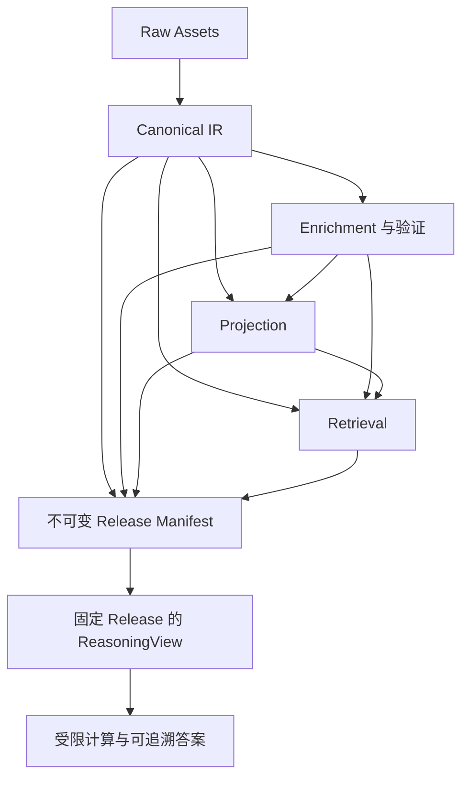

# 企业 PDF 可追溯多模态 RAG — PRD v0.1

状态：**Draft / 待确认**。本文件是需求、架构和验收草案，不表示功能已经实现或达到生产指标。
日期：2026-09-19。目标运行时：Python 3.12。项目名称、初始化目录和部署环境在批准后确定。
本轮交付仅包含文档；不生成项目代码、仓库脚手架或测试，不发布 issue，不提交、推送或部署。

## 1. 问题陈述

公司希望对 PDF 报告进行可靠检索、财务问答和证据核验。
首个业务场景是财务报告，主要输入为 PPTX 打印导出的 PDF，包含并排图表、多级表头、合并单元格、脚注和复杂页面布局。
直接提取整页文字会破坏区域关系；过早转换 Markdown 会丢失空白、不可用、合并拓扑和数值所属的完整表头。
模型能够生成流畅答案，但无法自动保证数值、单位、期间、财务口径和引用位置正确。
当前攻坚重点是高效、准确、可审阅、可增量重跑的 ingestion，而不是优先扩大 Agent 工作流数量。

系统必须回答三个不同问题：原件中观察到了什么、系统如何解释它、哪些证据有资格支持本次答案。
可追溯不等于内容客观正确；忠实转录“预计增长 20%”不表示系统已经审计或验证该预测。
待确认的真实准确率、吞吐量和费用目标必须通过代表样本确定，不预设已经达到某个百分比。

## 2. 方案与产品边界

建设独立的企业 PDF 通用后端，以财务作为第一个可配置领域 profile。
采用 FastAPI API 与 worker 组成的模块化后端；首版不依赖 AgentHub，也不要求先建设独立微服务集群。
pdfspine 是生产路径唯一打开、解析和渲染 PDF 的入口。
ragspine 的检索、分段、复核或其他能力可通过 adapters 复用，不能成为领域模型或事实来源。
LangGraph 若采用，仅负责应用用例的有界编排；业务规则和正确性不依赖其运行时。

### 2.1 六个数据边界

| 边界 | 保存内容 | 明确限制 |
| --- | --- | --- |
| Raw Assets | 不可变原始 PDF；由 pdfspine 生成的页面图、裁剪图；内容摘要、生成参数和坐标变换 | 图像派生物保留父资产关系；不能覆盖原件或丢失来源 |
| Canonical IR | 版本化文档、页面、八类元素、几何定位、原始内容、关系及解析观察的不确定性 | 不包含无来源的模型补全；不因解释修正而修改既有 artifact |
| Enrichment | 表头解释、图表 grammar、领域映射、模型观察候选、推断、验证和人工修正 | 每项引用上游 evidence；不覆盖 Canonical 的文字、网格或来源 |
| Projection | 可重建 Markdown、表格行、财务数据视图、viewer 视图等 | 是派生展示或数据形态，不成为新的事实源 |
| Retrieval | 词法、向量、结构化检索索引及 evidence pointers | 索引和摘要不替代原始证据；与 Projection 有独立指纹和生命周期 |
| ReasoningView | 同一固定 release 下，经资格验证后供回答或计算使用的证据集合 | 不是模型隐藏思维链；不将模型回答回写成事实 |

Projection 可以作为索引构建输入，但显示模板变化只有在该索引确实依赖该投影时才触发重建。
所有引用经 release manifest 绑定；图中箭头表示有版本的依赖，不代表可以读取任意“最新”结果。

### 2.2 范围与首版能力

支持 PDF 上传、源版本管理、解析、复核、索引、检索、TableQA、限定范围的 ChartQA、有界 Agentic RAG 和引用解析。
财务 profile 管理指标词典、公司实体、期间、币种、数量级、实际/预算/预测、合并口径、重述版本及验证规则。
没有 PPTX 原件时继续处理 PDF；检测到 PowerPoint/Keynote 导出只能影响策略，不能直接要求源文件后停止 ingestion。
原生文字优先；难区域按质量策略调用 OCR/VLM 增强端口，输入限于已生成的页面或裁剪资产。
不能将原 PDF 交给替代 PDF parser，也不能让模型 response 直接创建、覆盖或发布 Canonical。
增强输出先作为带证据的候选进入 Enrichment，经严格校验和资格判断后才能参与投影、检索或回答。
无法识别的区域保留 Image、Group、unknown 和具体原因；八类 IR 可表达不等于八类高级识别算法均已实现。

## 3. 用户故事

1. 作为资料管理员，我希望上传 PDF 并得到不可变源版本，以便后续处理与答案始终对应明确原件。
2. 作为财务分析师，我希望直接处理 PPT 打印 PDF，以便没有 PPTX 源文件时仍能使用系统。
3. 作为资料管理员，我希望观察 ingestion 的阶段、进度、耗时、费用和失败区域，以便判断是否需要介入。
4. 作为分析师，我希望看到文字、表格、图表和脚注的页面位置及关联，以便复核复杂报告的上下文。
5. 作为分析师，我希望区分真实空白、无法读取和合并延续格，以免普通单元格被误判为合并单元格。
6. 作为分析师，我希望多级行列表头形成有证据的完整路径，以便识别同期间不同财务口径的数据。
7. 作为分析师，我希望看到数字的原始显示、单位、数量级和规范值，以便发现转换错误。
8. 作为分析师，我希望同一指标的实际、预算、预测和重述值共存，以免新入库数据覆盖不同事实。
9. 作为分析师，我希望图表明确区分标签读数、计算结果、视觉估计和不可识别结果，以便选择适合的用途。
10. 作为审核者，我希望修正表头、单位或图例映射且保留原观察，以便审计解释变化及其影响。
11. 作为审核者，我希望批准或拒绝具体区域和字段，以便将人工审核集中在不确定内容上。
12. 作为查询者，我希望按正文、表格结构和图表线索检索，以便找到真正支持问题的证据。
13. 作为查询者，我希望每个返回结论都能定位到字段、单元格或图表区域，以便点击核验。
14. 作为查询者，我希望证据不足或相互冲突时系统明确拒答，以免用猜测填补财务信息。
15. 作为查询者，我希望金额比较、差额和比率使用确定性计算，以免模型自由生成数字。
16. 作为查询者，我希望一次问答、分页及后续引用保持同一 release，以免新旧版本混在一个答案中。
17. 作为平台维护者，我希望重跑只执行受影响的阶段，以便控制解析、模型和索引成本。
18. 作为平台维护者，我希望重复请求、worker 重试和崩溃恢复不会重复发布或污染有效版本。
19. 作为资料管理员，我希望发布、回滚和撤回都有审计依据，以便控制对外可见的资料范围。
20. 作为安全管理员，我希望缓存、检索和答案出站都遵守当前租户权限与撤回状态，以免旧快照绕过授权。
21. 作为查询者，我希望 Agent 只调用有界、只读、类型化工具，以便错误或文档中的恶意指令不会触发越权行为。
22. 作为验收者，我希望同时看到正确率、回答覆盖率和拒答率，以免系统靠全部拒答取得虚假高分。

## 4. 实现决策

### 4.1 领域、应用与适配器

领域层仅依赖 Python 标准库，使用不可变 value objects、enums、显式结果类型和 Protocols。
领域集合及 frozen 对象的嵌套成员也使用不可变表示；不得将可变 SDK response、SQL 行、向量 SDK 对象或模型原始 JSON 作为领域实体。
Pydantic v2 用于 HTTP、文件、模型及存储边界的严格验证和版本化 schema，再显式映射到领域对象。
未知字段、类型不匹配、非法枚举和违反不变量的输入必须显式拒绝；迁移由版本化规则处理，不静默吞字段。
应用层负责用例、事务边界、调度、发布资格与跨端口协调；adapters 负责 I/O 和第三方依赖。
domain 不导入 FastAPI、Pydantic、pdfspine、LLM、数据库、向量库或 LangGraph。

| Port | 最小责任 | Adapter 约束 |
| --- | --- | --- |
| PDFParser | 接受源资产引用，返回有版本的页面、区域、文字、网格和渲染观察 | 唯一生产实现入口为 pdfspine；后端选择不改变领域契约 |
| AssetStore | 按摘要保存和读取不可变资产、支持裁剪资产血缘 | 返回资产引用，不暴露存储 SDK 对象 |
| ArtifactRepository | 保存和读取版本化 IR、解释、投影、验证及依赖关系 | 不提供绕过校验的任意领域对象修改 |
| Enricher / LLM / Embedding | 对指定 evidence 执行增强、受限生成或编码 | 输入输出验证；模型配置显式注入；禁止直接发布事实 |
| Lexical / Vector / Structural Retrieval | 在指定 generation 与授权范围中返回命中和 evidence pointers | 支持 readiness 验证；不自动回退到另一版本 |
| PublicationRepository | 候选 manifest、发布 CAS、审计、撤回状态与 release pins | 权威状态使用具有事务语义的实现 |
| Jobs / Clock / ID | 任务租约、fencing、预算、时钟和标识分配 | 时间、重试和 ID 可注入；不得依赖隐藏进程全局状态 |

Python 3.12 是明确要求，优先于技能模板中的其他默认版本；mypy strict 与 Ruff 均以 py312 为目标。
依赖由应用组合根注入；财务 profile 替换词典和规则，不替换通用领域模型的来源与发布不变量。
Provider 显式声明 text、vision、tools、structured output capabilities，并通过对应合同测试；文本请求成功不能证明视觉或工具能力可用。
production profile 缺少配置时明确失败，禁止自动 fallback 到 mock；发布门拒绝 mock 产物及其下游，manifest 记录 execution mode 与实际 provider 版本状态。

### 4.2 CanonicalDocumentIR 与八类元素

CanonicalDocumentIR 包含 schema_version、source_revision、页面集合、元素集合、关系、解析 fingerprint 和质量报告。
每个元素包含稳定域明确的 ID、page reference、coordinate frame、bbox/polygon、原始内容引用和 observation status。
分类观察同样记录 producer、方法和状态；pdfspine 仅提供 figure 时可保存为 Image/Group，Enrichment 附 chart 解释并派生 ChartView，不为凑类型伪造 Canonical Chart 事实。
页面记录尺寸、旋转与原坐标到渲染/裁剪坐标的变换；不能只保存无坐标系说明的四个数字。
文本 offset 绑定确切 text artifact，以 Unicode code point 计数并采用零基 [start, end)；归一化文本必须保留到原文的映射，不能混用字节或 UTF-16 offset。
解析观察可以不确定；Canonical 的承诺是忠实保存有来源的观察和结构，不是宣称所有观察正确。

| 类型 | Canonical 内容 | 不自动做出的判断 |
| --- | --- | --- |
| Text | 原始文本、token/span、位置、样式和读取顺序观察 | 不把报告中的断言当作经过审计的客观事实 |
| List | 列表项、标记、嵌套和来源 | 不因视觉缩进自动赋予财务分类语义 |
| Table | 网格、单元格、跨度、文字与位置、未解区域 | 不凭空填值或把复杂表头压成第一行 |
| Chart | 图表区域及可定位的文字、形状、颜色等观察 | 不强选图种或自动生成精确数据系列 |
| Diagram | 区域、节点/连线等能够定位的观察 | 不将连接线自动解释为因果或资金流 |
| Image | 原始或裁剪图像引用、位置及来源变换 | 不把无把握的图像分类强行提升为其他类型 |
| Formula | 可定位的公式文本/符号观察及图像引用 | 不把 OCR 结果视为已经可执行且正确的公式 |
| Group | 同一区域的元素组合、包含及邻接关系 | 不将邻接自动解释成业务归属 |

关系必须可引用、可版本化，并标明属于几何观察还是解释；标题、图注、脚注的语义归属属于 Enrichment。
未知类型、未读文字和局部关系缺失是显式结果，不通过空字符串或缺失字段掩盖。

### 4.3 TypedCellGrid

拓扑完整性与内容可用性分别建模，不能用一组 None 同时表示两者。
有效 origin cell 必须拥有唯一 cell_id、row、col、row_span、col_span 和可追溯 bbox。
row/col 使用统一的内部零基约定，API 明确该约定；页面显示编号与内部索引不得混用。
跨度为正整数，覆盖范围在 grid 内；origin 覆盖不得重叠。
continuation 必须指向同一 grid 唯一 origin，且该槽确实位于其覆盖范围；禁止循环、跨表和指向 continuation。

| 内容/槽位状态 | 含义 | 允许的行为 |
| --- | --- | --- |
| present | 已提取物理 origin 的内容 | 保留原始内容、证据和提取状态 |
| blank | 已知物理 origin，解析器在其已处理内容通道内报告空白 | 保留观测范围与验证状态；不能推导为 0 或合并 |
| unavailable | 已知物理 origin，但未能可靠读取内容 | 必须保留 reason；不能当空白、0 或缺失 origin |
| continuation | 被 origin 的 rowspan/colspan 覆盖 | 返回唯一 origin 引用，不另造物理单元格或重复数值 |

pdfspine 的 blank 信号不等于证明区域物理无内容；Canonical 保留 parser 原始观测及已有验证结果，后续资格判断不覆盖原信号。
若文字未提取到但仍有未读图像、公式等内容，必须表达 unavailable/未解范围，不能按已验证 blank 或 0 使用。
拓扑未知的区域另列 topology_status 与 unresolved regions；不能伪造 origin 后标 blank 来凑完整矩阵。
部分拓扑不能冒充完整有效 TypedCellGrid；其可用子区域和不可用范围进入质量报告。
多级表头、行头树、单位作用范围、脚注关联和跨页续表关系属于可版本化 Enrichment。
每条 header path 引用真实祖先 cell IDs；合并范围不能通过单纯向右或向下填空猜测。
跨页表允许候选关联；重复表头、单位、列结构或续表关系有歧义时保留分表并进入复核。

### 4.4 GrammarBasedObservations 与 ChartQA

Chart grammar 表达 axes、scales、ticks、legend、marks、labels、series 及 encoding 关系，并逐项绑定 evidence。
类别轴、时间轴、对数轴、双轴、堆叠及图例到系列的映射不能互相套用；不支持的 grammar 显式 unknown。
grammar 是版本化解释产物，引用 Canonical 的区域和观察；候选模型输出不能直接成为已验证 grammar。

| 数值类别 | 成立条件 | 精确问答资格 |
| --- | --- | --- |
| explicit | PDF 中存在可定位的数字标签，且值与对象对应关系已验证 | 通过字段及语义校验后可使用 |
| derived | 由具备资格的输入，经记录的确定性表达式计算 | 输入、单位、公式和舍入规则均通过后可使用 |
| estimated | 由位置、柱高、面积、像素或视觉模型估计 | 不用于精确数值回答；如将来展示必须明确估计与范围 |
| unavailable | 缺少读数、对应关系或受支持 grammar | 拒绝精确数字，保留图像、可靠标签和缺失原因 |

即使柱高插值使用确定性算术，其输入仍是几何测量，因此结果仍属于 estimated。
首版精确 ChartQA 支持明确数据标签且对应关系已验证的图表区域，不承诺从无标签图形恢复精确数字。
遇到未知图种可检索原图与可靠文字，回答“无法获得精确读数”；不能悄悄按普通柱状图解释。
首版 grammar 的具体图种范围在待确认决策中冻结；后续图种按相同契约和验收方法逐一扩展。

### 4.5 字段证据、推断与验证

每个关键字段的 evidence 包含 source revision、page、coordinate frame、rotation/transform、region/token/cell 和 field path。
跨区域字段可以引用多个 evidence；不能仅给整个对象或整个回答一个文档 URL。
来源解析器、工具/模型、artifact、版本、输入引用和处理 fingerprint 必须可追踪。
LLM 输出或 SDK response 只能作为候选结果，不能引用自身来证明其中的事实；证据必须追溯到源资产或合格上游观察。
模型没有可获得的不可变版本时记录 reported version 与 unpinned 状态，明确降低可复现性等级。
confidence 使用有类型的 known/unknown 表示；已知分数同时记录产生方法和意义，不能跨不同模型直接比较。
验证记录按结构、来源、语义和数值范围分开，包含规则 ID/版本、结果、适用范围、时间和审核者。
pending、passed、failed、not_applicable 分开；高 confidence 不能将 pending/failed 自动晋升为通过。
通过“来源可定位”校验，不代表币种、期间或指标解释通过；人工批准也必须声明批准范围。
推断和字段修正保留历史，以新增 correction/interpretation artifact 表达，不能覆盖原观察。
派生 lineage 是无环图，保存输入 observation IDs、表达式、规则版本、单位转换和精度。
普通源修订、待审批 correction 或 supersede 只影响新构建的依赖选择及下游重算，不原地修改或破坏旧 release 的不可变产物。
已确认错误的字段/解释必须记录对应 reject/revoke；当前资格撤销与 ACL、withdraw 一样实时约束旧快照，阻止被撤销证据及其依赖用于新输出，不能通过 rollback 恢复资格。
资格变化不删除原始历史观察与审计；新 projection、index 和 ReasoningView 根据有效依赖重建，并保留失效原因。

### 4.6 财务 profile 与确定性计算

金额和财务比例使用 Decimal，保留原始显示串、规范值、符号、币种、计量单位、数量级及显示精度。
空白、破折号、不可读、未披露、0 分别表达；禁止统一 strip 后转 float。
括号负数、百分数、百分点、基点、约数和百万/亿元等数量级使用显式、可测试的转换规则。
期间区分 instant 与 duration，保存起止日期、财年日历和显示标签；FY/Q/YTD 不由字符串拼接猜测。
事实身份需包括适用的公司、指标、期间、场景、币种、合并口径及源/重述版本，允许不同口径并存。
公司词典或模板提供的解释仍保留配置版本和适用范围；缺少依据时不能默认 USD、自然年或 Actual。
一致性验证须声明适用前提与舍入容差；检查通过不等价于客观财务审计结论。
精确差额、汇总、比率等由受限确定性计算器执行；仅允许批准的运算、合格输入及明确的零分母/精度规则。
LLM 可提出类型化计算请求，但不能将自由生成的数值直接作为最终精确答案发布。

### 4.7 标识、版本与增量 DAG

| 标识 | 稳定域与用途 |
| --- | --- |
| logical_document_id | 文档业务身份，由目录管理，不能仅由文件名推断 |
| source_revision_id | 不可变源内容版本，绑定资产摘要与目录 revision |
| page / element / observation ID | 在明确源版本及解析稳定域中定位对象；重复内容也保留独立位置身份 |
| artifact ID | 不可变实际结果身份，绑定本阶段请求指纹、实际输出 content digest 和执行来源 |
| run / attempt ID | 一次执行及其尝试，用于租约、预算和审计，不冒充内容身份 |
| index_generation ID | 一套具有可证明依赖和可读状态的索引 generation |
| release ID | 不可变 manifest 的身份；active pointer revision 单调推进 |

同源、同阶段指纹的重复任务必须幂等；依赖只包含真正影响本阶段输出的输入。
stage fingerprint 标识计算请求和缓存资格，不等于随机模型的实际输出身份；强制重跑产生不同输出时创建新 artifact 并保留 attempt，不能覆盖同指纹的旧结果。
更换 embedding 或问答 prompt 不得导致 Canonical IDs 全量变化。
跨源插页、换解析器、区域边界变化通过 alignment/supersedes 记录对应；重复页面等歧义禁止自动合并。
缓存复用保证复用同一已保存 artifact，不承诺重新调用 LLM 会产生相同字节。
重执行结果若不同，保留独立 run/result 与可复现性信息，不能覆盖曾被 release 引用的产物。

| 变化 | 应失效的范围 | 不应重做的范围 |
| --- | --- | --- |
| embedding 模型/编码参数 | 依赖该编码的 Retrieval generation | PDF 解析、Canonical、无关 Projection |
| 显示模板 | 对应 Projection；仅其真实索引消费者继续失效 | Canonical、无依赖的检索索引 |
| 表头/单位修正 | 相关 Enrichment 后代、财务投影、索引和问答资格 | 原始 PDF、既有 Canonical 观察 |
| 解析器或 Canonical schema | 受影响解析段及其依赖后代 | 能证明不受影响的独立资产和阶段 |
| 权限或撤回变化 | 可见性、缓存资格与答案出站判断立即更新 | 不通过重新解析来实施权限变化 |

worker 使用有界 page/region 并发、任务租约和递增 fencing token；过期 worker 不得提交有效结果或发布。
重试仅覆盖明确可重试错误，遵守阶段 timeout、次数、token/费用和全任务预算，不能无限 fallback。
OCR/VLM 按质量不足区域选择性调用，复用页面图和裁剪资产；超预算或仍不确定时暂停复核。
任务状态至少区分 queued、running、waiting_review、succeeded、failed、cancelled，另报阶段和局部覆盖状态。
持久化 job ledger 是任务状态真相；进程内有界队列只是调度缓存，重启后从 ledger 恢复，不依赖队列内存保留任务。
取消和重试不隐式发布，复用产物要重新检查依赖和有效性；全部局部失效必须可观察。

### 4.8 Release、发布事务与回收

所有 staging artifacts 和 index segments 均不可变；尚未发布的产物对普通检索不可见。
词法、向量和结构化索引主键包含 artifact/generation/segment 身份；禁止按 logical_document_id 原地 upsert 破坏旧 release。
候选 manifest 绑定源 catalog revision、全部依赖 artifact IDs、schema/模型版本、校验结果及覆盖范围。
索引 readiness 必须证明绑定的 segments/generation 已可读，包含水位与成员证据，不能仅比较条数。
索引若不能证明所需 generation 可读，则候选保持未就绪，不允许发布后靠最终一致性补齐。
权威发布仓库使用 SQL 事务执行 CAS：校验 expected active pointer revision、expected catalog revision 和 manifest ready。
active pointer revision 单调递增；更新、幂等结果记录、审计和 outbox 在同一事务完成，响应丢失后的重试恢复已提交结果。
外部索引写入不假装纳入 SQL 原子事务；重试发布不能产生第二次逻辑提交。
提交前后崩溃时，查询只看到完整旧 release 或完整新 release；恢复过程不得拼接两者。
每次查询只 pin 一次 release 快照，分页、缓存、计算、证据解析和最终引用均携带同一快照身份。
快照不可读时返回明确 unavailable，不能悄悄读取 latest 或另一个 generation。
回滚是指向保留的完整 release 的一次新 CAS，并生成新审计；不能降低 pointer revision。
回滚不恢复已经撤回的文档，也不回滚当前 ACL 或 tombstones；这些状态始终作为实时可见性约束。
GC 保留 active、rollback window、audit retention、有效 query pins 的依赖闭包；删除前再次校验引用和 pins。
不能仅因某 artifact 不在当前 active release 就删除；正在读取或用于审计的完整依赖必须保留。

### 4.9 发布质量、回答策略与安全

默认严格发布：源身份、坐标映射、证据关联或版本一致性出现系统性问题时阻断整份文档。
局部失败隔离到字段/区域；只有显式批准的 partial publication policy 才允许带 coverage manifest 发布部分文档。
partial manifest 必须列出合格范围、隔离范围、原因及批准记录；默认不能自动部分发布。
文档部分发布与答案 partial 是两个独立策略；允许前者不等于允许答案隐瞒缺失字段。
默认答案状态为 answered 或 abstained；仅显式 opt-in 才允许 partial，且必须列明 missing fields。
所有返回 claims 均须有合格证据；问题所需字段不全时默认 abstain，不用附近数字补位。
冲突证据不得按更高 confidence 自动选胜者；应拒绝确定结论或明确呈现冲突值及各自来源。
租户范围来自服务端认证上下文；请求体中的 tenant_id 不能扩大权限。
检索前执行权限过滤，evidence resolver、缓存返回和答案出站前重新校验当前授权与撤回状态。
缓存键包含租户、release、查询和相关策略身份，命中后仍进行当前授权检查。
源文档中的 prompt injection 一律作为待分析数据，不能覆盖系统指令、改变工具权限或触发外传。
Agent 只获得类型化、只读、有预算的检索、解析引用和计算工具；限定步数、时间、成本及结果大小。
工具拒绝、超时、无资格证据和预算耗尽必须形成可观察结果，禁止越权工具或替代 parser 兜底。

## 5. API 契约

HTTP DTO 与领域对象显式映射；所有 artifact 和响应载荷携带 schema version，破坏性变更使用新版本契约。
以下路径表示逻辑 API 资源；最终命名可以在初始化时调整，但行为、状态码及并发语义不得弱化。

| 操作 | HTTP 契约 | 关键输入/输出 |
| --- | --- | --- |
| 上传文档或新增源版本 | POST /v1/documents；POST /v1/documents/{id}/revisions → 201 | PDF 资产、摘要、logical/source revision；不会隐式发布 |
| 创建 ingestion job | POST /v1/ingestion-jobs → 202 | source revision、profile、阶段策略；返回 job ID 与状态链接 |
| 任务状态 | GET /v1/jobs/{id} → 200 | 阶段、尝试、覆盖、预算、错误、复核需求和 artifact references |
| 取消/重试 | POST /v1/jobs/{id}/cancel；POST /v1/jobs/{id}/retry → 202 | 明确取消请求或新 attempt；终态及租约规则由契约校验 |
| 读取 IR/质量/产物 | GET /v1/documents/{id}/revisions/{revision}/ir、/quality、/artifacts → 200 | 不可变版本、坐标约定、资格状态和未解区域 |
| 提交复核决策 | POST /v1/review-decisions → 201 | evidence IDs、expected revision、批准范围/修正；产生新 correction 与后续 job |
| 搜索 | POST /v1/search → 200 | 查询、过滤条件；返回 pinned snapshot、hits、evidence pointers 与覆盖说明 |
| 问答 | POST /v1/queries → 200；显式 async 模式 → 202 | 200 返回 answered/abstained/opt-in partial；202 返回 query job ID 和同一结果契约 |
| 读取异步问答 | GET /v1/query-jobs/{id} → 200 | 运行状态或最终回答；结果绑定执行时取得的 release pin |
| 创建 release candidate | POST /v1/release-candidates → 202 | catalog revision、artifact/index 依赖；返回 readiness 验证任务 |
| 发布 | POST /v1/releases/publish → 200 | candidate、expected pointer/catalog revisions；返回 release 与新 pointer revision |
| 回滚 | POST /v1/releases/rollback → 200 | 目标 release、expected pointer revision、原因；执行新的 CAS |
| 解析证据 | POST /v1/evidence/resolve → 200 | snapshot 与 evidence references；返回授权后的页/区域/字段定位 |
| 撤回文档 | POST /v1/documents/{id}/withdraw → 200 | expected revision、原因；立即记录 tombstone，异步执行物理清理 |

写请求接受 Idempotency-Key：同租户、同操作、同 key/同规范化请求体返回同一逻辑结果；同 key 不同请求体返回 409。
并发写使用 ETag/expected revision；版本或 CAS 冲突统一 409，不隐式覆盖他人修正。
输入/schema/领域不变量不满足返回 422；快照或必要依赖不可用返回 503，并说明可否重试。
正常拒答是业务结果，返回 200 与 abstained reason，不作为 500；认证/授权失败使用 401/403。
异步问答在获取 release pin 后才执行检索，并将该 pin 保存于 job；不能在各次重试中随意切换快照。
响应包含 request/job/run references 供审计；不返回凭证、无权限内容或模型隐藏推理过程。
如提供 SSE，只能先发送进度和快照；答案/证据内容经资格验证后才允许输出，禁止先流出未校验的模型 token。
授权线性化点是每个含答案/证据响应或 SSE 事件进入出站缓冲前的最终授权判定；此后发生撤回会阻止后续事件，不能声称可收回已发送字节。

## 6. ADR 顺序与分阶段计划

批准后先记录 ADR，再在每个阶段实施 TDD 纵向切片；不得先写完所有测试再批量实现。
每次循环为一个可观察行为的 red test → 最小实现 → green → refactor，并保持上一阶段验收持续通过。
ADR 顺序：领域边界与唯一 parser → IR/证据/ID → 表格与图表资格 → artifact DAG/任务 → release/事务 → 检索/回答/权限 → 运维。

| 阶段 | 可交付能力 | 退出条件 |
| --- | --- | --- |
| P0 契约和夹具 | 领域协议、schema、依赖边界、合成 PDF/金标格式、离线 harness、质量门 | 一个最小契约纵切 green；边界和 schema drift guard 可运行，不堆无行为空类 |
| P1 最小证据链 | 真实 PDF 经 pdfspine → Raw/Canonical → artifact/evidence API；八类型可表达且 unknown 诚实 | 每条可用观察回到原页；确认代表样本、profile 和基准目标；不向外部模型传真实财报 |
| P2 表格和布局 | TypedCellGrid、复杂表头解释、布局/脚注关系、拓扑和读取失败处理 | blank/unavailable/span 混合及三 backend 合同通过；难例进入明确质量状态 |
| P3 可靠 ingestion | jobs、租约/fencing、预算、缓存、增量 DAG、取消重试、复核修正 | 崩溃/重复/陈旧 worker 不污染产物；无关阶段不重做，局部失败可观察 |
| P4 发布、检索与 TableQA | manifest/readiness/CAS、三类检索、固定快照、财务 profile、确定性计算和字段引用 | 正确发布完整 generation；TableQA 同时报准确率/覆盖/拒答；权限与版本不混用 |
| P5 图表与复核 | GrammarBasedObservations、限定 ChartQA、图例/系列映射与审核 | 显式标签通过后可答；视觉估计/未知 grammar 不冒充精确值；完整 lineage 可审阅 |
| P6 有界 Agent 与运维 | 只读 Agentic RAG、回滚/撤回/GC、缓存授权、观测、性能和最终回归 | 所有本 PRD 功能有通过的验收；预算、注入、故障、真实 adapter 和离线 gate 完成 |

阶段顺序可因真实样本调整，但不可将必需能力永久留为 vNext 空接口，也不能跳过先前质量门。
每阶段均有可运行的完整小链路；尚未支持的输入类型通过 unknown/abstain 表达能力边界。

## 7. 测试决策与验收矩阵

测试通过公开领域/应用/API 接口验证用户可见行为，不固定私有函数、内部调用次数或类的布局。
优先复用 pdfspine 三 backend 槽位一致性思路、ragspine 协议 conformance 思路；不能把已有测试通过视为新系统验收通过。
内存 fake 用于快速领域测试；SQL 事务、CAS、索引可读性与真实 backend 行为须由真实 adapter contract 验证。
本地可使用预置数据库及向量服务，不要求测试通过远程服务；离线 gate 禁止外部调用和模型下载。
真实 backend 模型权重须预置并校验版本/摘要；缺少权重必须明确列出未完成 gate，fake 不算该 backend 的验收证据。

| 编号 | 验收行为/反例 | 必须观察到的结果 |
| --- | --- | --- |
| A01 | 八种 IR 元素分别存在合法与 unknown/局部不可用样例 | schema、位置、来源可解析；未知能力不被伪装成成功识别 |
| A02 | 原 PDF 经 native/TATR/ONNX 固定离线夹具生成网格 | 相同领域不变量成立；真实 backend 单独报告，结构可存在真实差异 |
| A03 | 普通空白、无文字、rowspan、colspan、空白与合并同表 | 每个 continuation 唯一回 origin；blank/unavailable 不互换；span/bbox 不丢失 |
| A04 | 重叠 span、越界、循环/跨表 origin、未知拓扑 | 不生成合法完整 grid；明确失败范围，不静默补空格 |
| A05 | 多级/重复表头、续表、脚注和相同数字不同列 | 表头路径引用祖先 cell；歧义不串列，不自动拼接错误表 |
| A06 | 币种/数量级/期间/Actual-Budget/合并口径/重述并存 | 事实不覆盖；Decimal 转换和显示精度正确；未知维度保留 unresolved |
| A07 | 括号负数、百分数、百分点、破折号、0 和未披露 | 语义区分；不能统一浮点化或把缺失记作零 |
| A08 | 显式图表标签、无标签柱高、双轴歧义、未知 grammar | 合格 explicit/derived 可答；estimated/unavailable 不生成精确数字 |
| A09 | confidence 很高但来源缺失、语义冲突或校验失败 | 不能自动通过；说明验证范围与拒答/复核原因 |
| A10 | 返回 claims、公式输入和多区域字段 | 100% 返回 claims 有可解析的字段证据；不以文档级链接代替；派生 DAG 完整 |
| A11 | 新版本发布时继续分页、缓存命中和解析旧答案引用 | 全程同一 release；不存在跨 release 证据或计算混用 |
| A12 | 重复请求、同 key 不同 body、stale worker、取消后提交、响应丢失 | 幂等结果或明确 409；fencing 拒绝陈旧写，从事务记录恢复成功结果 |
| A13 | 索引落后、相同条数但成员不同、缺失 segment | readiness 不通过；不发布；必要时返回 snapshot unavailable |
| A14 | 两人并发发布、catalog 已变化、事务各崩溃点 | CAS 冲突明确；查询只见完整旧/新版；audit/outbox 与提交一致 |
| A15 | 撤回后回滚、正在查询时 GC、审计保留窗口 | tombstone/ACL 不复活；pins 和保留闭包不被删除；GC 二次校验 |
| A16 | 缓存已有内容后用户权限收回或跨租户请求 | 检索与出站均阻断，无缓存绕权或 evidence resolver 泄漏 |
| A17 | embedding/display/header/单位分别变化 | 仅真实 DAG 后代重建；Canonical 不因 embedding/prompt 改变而全量换 ID |
| A18 | 插入首页、重复页面、解析器版本变化 | 原引用仍绑定原 revision；通过 alignment 关联，歧义不强行继承身份 |
| A19 | 局部解析失败、系统性坐标失败、冲突证据 | 默认严格发布/拒答；批准的 partial 明示覆盖和缺失，冲突不按分数选赢家 |
| A20 | PDF 包含恶意指令、Agent 请求写工具、预算耗尽 | 文档不变成指令；工具拒绝和停机可观察，无越权 fallback |
| A21 | production 缺配置、mock 下游产物、仅 text 能力 provider 接收图像 | 明确拒绝；能力合同分别验证；测试替身不能获得生产发布资格 |
| A22 | SSE 生成未验证数字，或流中撤回权限 | 只先发进度；不输出未验证 claim；线性化点后阻止后续内容，已发事件保留审计 |

关键不变量须全部通过，不以平均分抵消证据串版本、权限泄漏、非法拓扑或不可靠发布。
业务评测同时报告 precision、answer coverage、refusal rate、冲突识别、引用定位正确率以及各类输入的分层结果。
全拒答不算业务通过；必须在冻结金标中的可回答样本上达到待确认覆盖目标，同时正确拒绝不可回答样本。
性能报告包含每页/每文档延迟分布、吞吐、内存、OCR/VLM 触发率、缓存命中和增量节省、模型调用与费用。
P1 使用经授权的代表样本冻结金标、样本拆分、数值容差和 SLO/预算；模型/配置变化需按相同口径回归。
真实公司财报不默认发送外部模型；离线 CI 使用合成或明确获授权的固定夹具。

### 7.1 工程质量门

使用锁定工具链；make fmt 仅作本地写入 cleanup，顺序为 Ruff check 的 safe fix → Ruff format，不启用 unsafe fixes。
./ci.sh 是唯一只读工程质量门，执行 ruff format --check、ruff check --no-fix 和 mypy strict（py312）；禁止 fix、exit-zero 或忽略失败退出码。
运行 architecture dependency、schema compatibility、drift guard 和公开契约测试，防止 domain 被 SDK 侵入。
pytest 将 warnings 作为 error，必须实际收集且运行测试（收集数量大于 0），核心 gate 不允许静默全 skip。
不得靠全局 ignore、无依据 noqa、降低检查等级、unsafe 自动修复或 LLM 手工格式化来取得绿灯。
./ci.sh 包含当前阶段全部必需的离线测试及预置本地真实 adapter suites；数据库、服务与校验过的模型提前就绪，执行时不访问外网或下载依赖/模型。
live provider 的真实能力与质量资格单列受控验收证据，不构成第二套日常 CI，也不成为每次工程门的付费外网依赖；离线与真实 adapter suite 不能相互冒充。
只在 green 后重构，并回跑受影响契约；不为私有实现细节编写脆弱的镜像测试。

## 8. 本 PRD 范围外

不建设 Dify 式通用应用市场、全面工作流编辑器或广泛 RBAC 产品；保留满足本后端所需的租户和权限能力。
不把 AgentHub 作为运行依赖，不复制其整个产品；可参考现有工程经验并通过 adapters 复用合适能力。
不支持替代 PDF parser 绕过 pdfspine，不承诺恢复 PDF 中根本不存在的原生 PPTX 图表数据。
不默认把视觉估计用于精确财务数值，不把文档断言等同于审计结论，不实现无约束 Agent 写操作。
当前文档不承诺交付日期、生产准确率、硬件吞吐或全图种识别；这些目标由样本和阶段 gate 决定。

## 9. 待确认决策

1. **部分发布/部分回答**：建议两者默认关闭；如需启用，分别配置明确 policy、批准流程和缺失范围展示。
2. **首版 ChartQA**：建议只支持明确标签且对应关系可验证的图表；先选常见柱状/折线/饼图的受限 grammar，复杂双轴/瀑布等保留 unknown；视觉估计不纳入精确答案。
3. **基准与 SLO**：建议 P1 根据代表性 PPT 导出 PDF、扫描区域、复杂表格和财务口径冻结金标、覆盖目标、准确率、延迟及费用预算。
4. **后端存储默认**：建议 PostgreSQL 管理权威目录、发布、任务与审计，内容寻址对象存储保存 assets/artifacts；词法/向量/结构化检索均通过 ports，可先采用 PostgreSQL/pgvector 组合，是否拆分专用检索后端由规模评测决定。

可确认整份文档或逐项提出修改。确认后再创建项目、记录 ADR 并按阶段开展实现；当前没有应用代码或已完成生产验收的声明。

## 10. 工具规则参考

- [Ruff 安全修复与修复行为](https://docs.astral.sh/ruff/linter/#fixes)
- [Ruff Formatter 与 import 排序的分工](https://docs.astral.sh/ruff/formatter/#sorting-imports)
- [Ruff Formatter 与冲突 lint 规则](https://docs.astral.sh/ruff/formatter/#conflicting-lint-rules)
